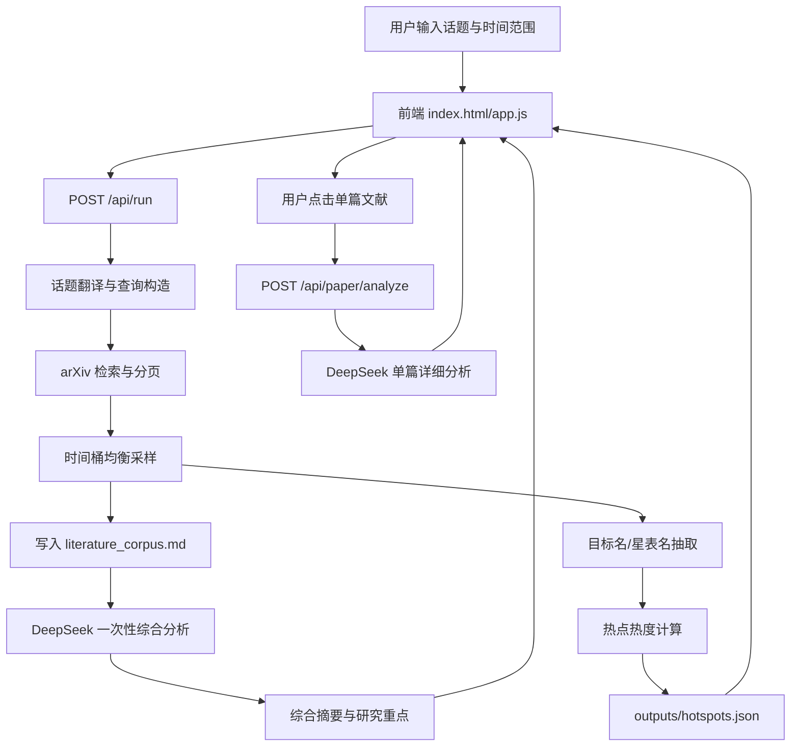

# 文献助手工具设计报告

版本：v2  
日期：2026-06-17

## 1. 建设目标

文献助手面向天文观测目标筛选的前置调研场景。用户输入感兴趣的话题和检索时间范围后，系统自动检索开放文献，生成综合分析，抽取文献中出现的恒星或宿主星目标，并导出热点目标 JSON，供后续观测目标筛选与排序工具使用。

系统同时支持按需深挖单篇文献：默认列表展示原始英文摘要，用户点击某篇文献后再调用大模型生成详细中文分析，从而避免对大量文献逐篇调用模型造成等待时间过长。

## 2. 核心使用流程

1. 用户输入研究话题，例如 `stellar activity`、`direct imaging exoplanets`、`分布式光干涉`。
2. 用户选择时间范围，例如一个月、半年、一年、两年、三年、五年或自定义月数。
3. 用户选择文献采集上限，例如 200、500、1000 或无上限。
4. 后端将中文话题映射为英文检索词，调用 arXiv 检索相关文献。
5. 系统按时间桶均衡采样，避免只返回最新一年文献。
6. 系统将所有文献写入 `outputs/literature_corpus.md`。
7. 系统调用一次 DeepSeek 对文献包做综合分析。
8. 系统从题名和摘要中抽取恒星、宿主星或星表目标。
9. 系统计算热点目标热度并导出 `outputs/hotspots.json`。
10. 用户可在界面点击单篇文献，按需调用 DeepSeek 生成详细中文分析。

## 3. 架构概览

## 4. 模块设计

### 4.1 前端模块

文件：

- `index.html`
- `styles.css`
- `app.js`

功能：

- 话题输入。
- 时间范围选择。
- 文献采集上限选择。
- DeepSeek API 配置弹窗。
- 综合分析展示。
- 热点目标表格与详情。
- 文献原始摘要展示。
- 单篇文献详细分析弹窗。
- `hotspots.json` 导出预览。

### 4.2 后端服务模块

文件：

- `server.py`

技术：

- Python 标准库 HTTP 服务。
- 无强制第三方依赖。
- 本地文件缓存。
- arXiv Atom API。
- DeepSeek Chat Completions API。

主要接口：

- `GET /api/status`：服务状态和配置状态。
- `GET /api/targets`：读取 221 条参考目标表。
- `GET /api/hotspots`：读取或生成热点结果。
- `GET /api/export`：下载 `hotspots.json`。
- `POST /api/run`：按话题运行文献检索、综合分析和热点目标抽取。
- `POST /api/paper/analyze`：按需生成单篇文献详细中文分析。
- `POST /api/deepseek/config`：保存 DeepSeek 配置。
- `POST /api/validate`：校验热点 JSON 格式。

## 5. 数据设计

### 5.1 输入数据

参考星表：

- `221_targets_literature_search_enriched.csv`
- fallback：`221.csv`

环境变量：

- `DEEPSEEK_API_KEY`
- `DEEPSEEK_BASE_URL`
- `DEEPSEEK_MODEL`
- `ADS_API_KEY`

配置文件：

- `config.json`，可选。
- `config.example.json`，模板。

### 5.2 输出数据

`outputs/literature_corpus.md`

- 当前话题文献包。
- 包含题名、作者、年份、来源、URL、相关性和原始摘要。
- 用作综合分析输入和人工复核材料。

`outputs/hotspots.json`

核心字段：

- `id`
- `name`
- `heat`
- `mention_count`
- `related_paper_count`
- `in_reference_catalog`
- `reference_catalog_id`
- `papers`
- `summary`
- `score_breakdown`
- `updated_at`

## 6. 检索与采样策略

### 6.1 话题翻译

系统对常见中文天文话题做英文检索词映射，例如：

- `系外宜居行星大气` -> `habitable exoplanet atmosphere`
- `分布式光干涉` -> `distributed optical interferometry`
- `直接成像` -> `direct imaging`

英文输入则直接使用用户词组，并扩展为 arXiv 查询变体。

### 6.2 时间桶均衡采样

为避免“2 年、200 篇”只返回最新年份论文，系统按年份桶采样。例如当前年份为 2026：

- 2 年：2025、2026 两个桶。
- 3 年：2024、2025、2026 三个桶。
- 5 年：2022 到 2026 五个桶。

每个桶先抓候选，再按配额合并，最后轮转展示。

## 7. 大模型使用策略

当前采用低调用次数策略：

- `/api/run`：只调用一次 DeepSeek，对整个文献包做综合分析。
- `/api/paper/analyze`：用户点击单篇文献时再调用 DeepSeek。

优势：

- 大幅降低 200 篇以上文献分析等待时间。
- 默认展示原始摘要，保证信息可追溯。
- 对重点文献按需深挖，节省 API 成本。

失败降级：

- DeepSeek 未配置或调用失败时，系统使用本地启发式综合分析和热度计算。
- 文献检索仍可工作。
- `hotspots.json` 仍可生成。

## 8. 热点目标抽取

系统从题名和摘要中识别：

- TIC 编号。
- TOI 编号。
- HD/HIP/GJ/Gliese/K2/Kepler/TRAPPIST 等目标名。
- Proxima Centauri、Alpha Centauri、Tau Ceti 等常见恒星名。
- 221 条参考表中的别名。

行星名会尽量归并到宿主星，例如：

- `TRAPPIST-1e` -> `TRAPPIST-1`
- `Kepler-452b` -> `Kepler-452`

## 9. 热度评分设计

热度评分由以下因素构成：

- 去重后的相关文献数。
- 当前时间范围内的近期程度。
- 文献相关性分数。
- 代表性文献数量。

输出 `score_breakdown` 便于后续解释和调参。

## 10. 部署设计

支持三种部署方式：

1. 本地 Python 直接运行。
2. Windows 桌面一键启动。
3. Docker / Docker Compose 部署。

部署包通过 `build_package.py` 生成，并排除密钥、缓存、日志和运行输出。

## 11. 已知限制

- arXiv API 偶发限流或断流，系统已捕获常见网络异常，但大规模检索仍可能较慢。
- ADS 检索依赖 `ADS_API_KEY`。
- DeepSeek 综合分析受模型上下文长度限制，系统会对文献摘要做截断。
- 热点目标抽取以规则和别名匹配为主，复杂命名仍需后续增强。

## 12. 后续扩展

- 增加 Semantic Scholar、OpenAlex、ADS 的统一检索接口。
- 增加后台任务队列，支持长任务进度条。
- 增加用户登录与项目化保存。
- 支持上传自定义目标星表。
- 支持导出 Word/PDF 综述报告。
- 引入更完整的天体命名解析服务。
